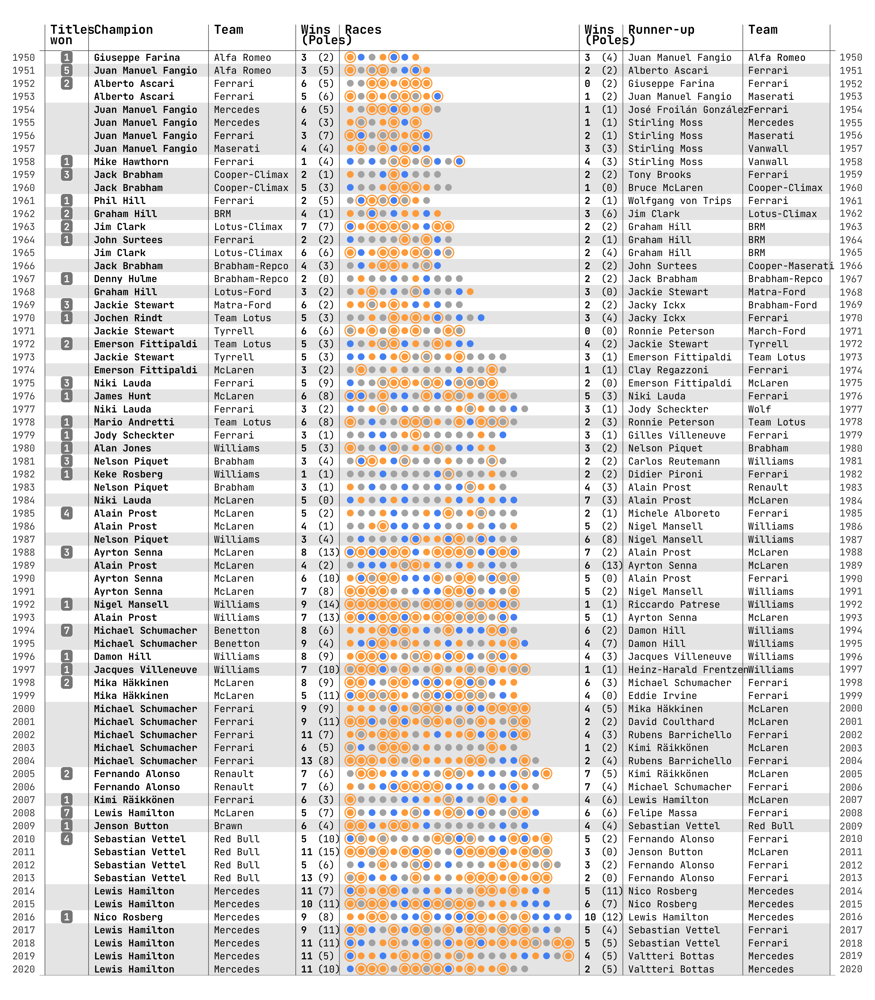

# Formula 1

Visualizations of Formula 1 data.

## Formula 1 World Champions 1950–2021

## Source code

- [formula1.R](./formula1.R)
- [Notes](./formula1.rmd) (Markdown)

## Dataset

- https://www.kaggle.com/rohanrao/formula-1-world-championship-1950-2020

## Tools & Resources

- R programming language
- VSCode
- Font: [JetBrains Mono](https://www.jetbrains.com/lp/mono/) (amazing!)
- Inspired by [@gkaramanis/tidytuesday](https://github.com/gkaramanis/tidytuesday/tree/master/2020/2020-week15).
