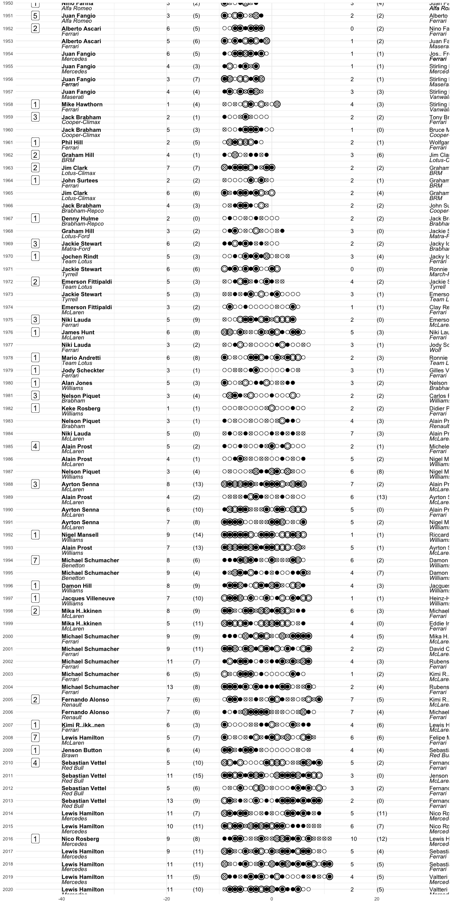

# Formula 1

Visualizations of Formula 1 data.

## Formula 1 World Champions 1950–2020

## Output

- [formula1.md](./formula1.md)

## Source dataset

- https://www.kaggle.com/rohanrao/formula-1-world-championship-1950-2020

## Tools

- R programming language
- VSCode
